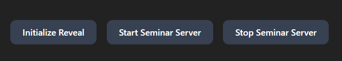
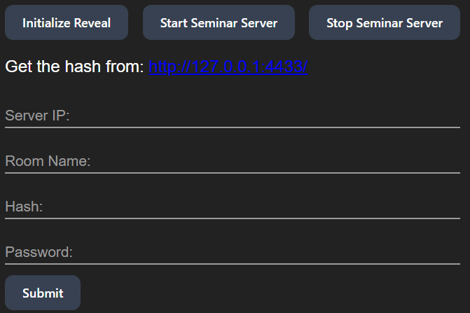

# Notion to Reveal.js Presentation App

This Electron application allows you to generate dynamic presentations from Notion pages using Reveal.js. 

## Features

- **Notion Integration:** Fetch content from Notion pages.
- **Markdown Conversion:** Convert Notion page content to Markdown.
- **Reveal.js Integration:** Create dynamic presentations using Reveal.js.
- **Save and Load Presentations:** Save presentations locally and reload them as needed.

## Installation

1. **Clone the repository:**
   ```bash
   git clone https://github.com/SchmidAlex/notion-presentation-generator.git
   cd notion-to-reveal-presentation
   ```

2. **Install dependencies:**
    ```bash
   npm install
   ```

3. **Run the application:**
    ```bash
    npm start
    ```

## Usage
1. **Create Notion Integration:**
    - Go to https://www.notion.so/my-integrations || Click in the upper-right corner of the notion app on the three dots. Go on "Connect with" and click on "manage connections". Click at the bottom on "Develop or manage my own integrations".
    - Create a new connection, note that this app just needs the read right on the sites and nothing more.
    - Safe your API-Secret for later to use this app.
2. **Give Your Integration Read Rights... Again:**
    - I struggled hours with that, but in order that your integration can read your sites you need to add it for each page or parent as integration.
    - To do so, go in your notion app on the desired page or parent.
    - Click on the three dots in the upper right corner.
    - Go on connect with.
    - Search for your integration name you newly created (yes you need to search it with text, it does not sho up from itself).
    - Add it to the page / parent.
3. **Start App and Setup API Key:**
    - The app uses the electron "electron-store" to save the API-Secret.
    - When starting the app without any API-Secret, you will have a small input field and button to fill it in and store it.
4. **Generate Presentastion:**
    - Be patient with the app... it is really really slow, as you can see there are code-fragments which are not in use and are not necessary. It is not done by now tho.
    - After a looong time, in the dropdown you have a list of your pages (sorted by last edited).
    - Select a Notion page from the dropdown.
    - Click "Generate Presentation" to convert the Notion page content into a presentation.
5. **View Presentation:**
    - The presentation will open in a new window.
    - Click in the new window on the button "initialize reveal" to, yes you name it, initialize reveal.
6. **Save and Load Presentation:**
    - Just click on save presentation when a presentation is currently loaded... there is no check if one is loaded or not. Give that html a name and a place to rest.
    - Just click on laod presentation and get the .html you want to load as presentation... there is no check if the loaded one is correct how it should be.
    - You can edit the saved files to make the presentation fancy.

## Dependencies
- Electron: Build cross-platform desktop apps with JavaScript, HTML, and CSS.
- Notion SDK: Official Notion API client for JavaScript.
- Reveal.js: A framework for easily creating beautiful presentations using HTML.
- Reveal.js Plugins: I integrated several Plugins into this app to have a nicer look and feel:
    - RevealNotes
    - RevealHighlight
    - RevealMath.MathJax3
    - RevealAnimate
    - RevealChalkboard
    - RevealChart
    - RevealZoom
    - RevealSearch
    - RevealMarkdown
    - RevealMenu
    - RevealFullscreen
    - RevealAnything
    - RevealCustomControls
    - RevealPoll
    - RevealQnA
    - Verticator
    - CopyCode
    - RevealSeminar

## Specialities
### RevealSeminar
For those who knows the Seminar-Plugin, know that for that a server is needed where Reveal is running. I integrated the Server as a Subprocess into the app (I call it the "server" in the text), but keep the "host" of the presentation completely seperated. To provide the presentation to the clients the host opens a socket, on which the client from the "server" connects to.
The socket on the "host" gets closed when:
- The "host" shutdown the seminar "server"
- When the "host" starts up the seminar "server" again (before opening again)
- When the app gets closed

In order to start the "server", a presentation needs to get picked for generating. On the presentation window there are 3 buttons:
- Initialize Reveal (to show the presentation)
- Start Seminar server (some configuration is needed)
- Stop the Seminar server (so you can stop it)



When now starting the server, some configuration-fields show up:



The IP is the local IP from your host, so clients in the same network can also have a look into the presentation and participate to polls and ask questions and so on.

The Room Name is a desired name of yours, it is needed for the configuration.

The Hash is the Hash from your password, open the link above the config and let the hash generate from your password.

The password is the one, from which you generate your hash from. It is needed so you can open the room and join as host.

**Important:** The host must initialize reveal, before the clients connects.

After the connection a client can enter the room by entering http://[your given IP]:4433/seminar.html in any webbrowser.

### Poll
Maybe one day it will possible to have a block in notion, which is usable for polls... At the moment it needs to be injected with html-code in the notion notes:
```
<div class="poll" data-poll="favoriteColor">
<p>Was ist deine Lieblingsfarbe?</p>
<button data-value="Red">Red</button>
<button data-value="Purple">Purple</button>
<button data-value="Yellow">Yellow</button>
<div class="voters" data-poll="favoriteColor">0</div>
</div>
```

### Chart
If using seminar and make a chart out of the answers, please consider the "data-poll" attribute in the poll and in the chart. They must be the same in order to work.

Here the same issue like the poll is present, notion does not have a block like that and no other block is usable for it. Thats why, again, it needs to be injected as html-code:
```
<div class="chart-container" style="position: relative; height:650px!important; width:980px!important">

<canvas id="chart" data-chart="bar" data-poll="favoriteColor">,Red,Purple,Yellow

label of data?,0,0,0</canvas>

</div>
```
Please also note the "height" and the "width" of the chart-container and change them if needed.

## Want to change something and package it by urself?
Clone the repo and make the changes you want. Build it you can use for windows this command:
```
npm run package-win
```
And for Mac you can use:
```
npm run package-mac
```
Keep in mind, that i did not test the application with mac.

## Contributing
Feel free to open issues or submit pull requests. Help or suggestions and contibutions are welcome!
